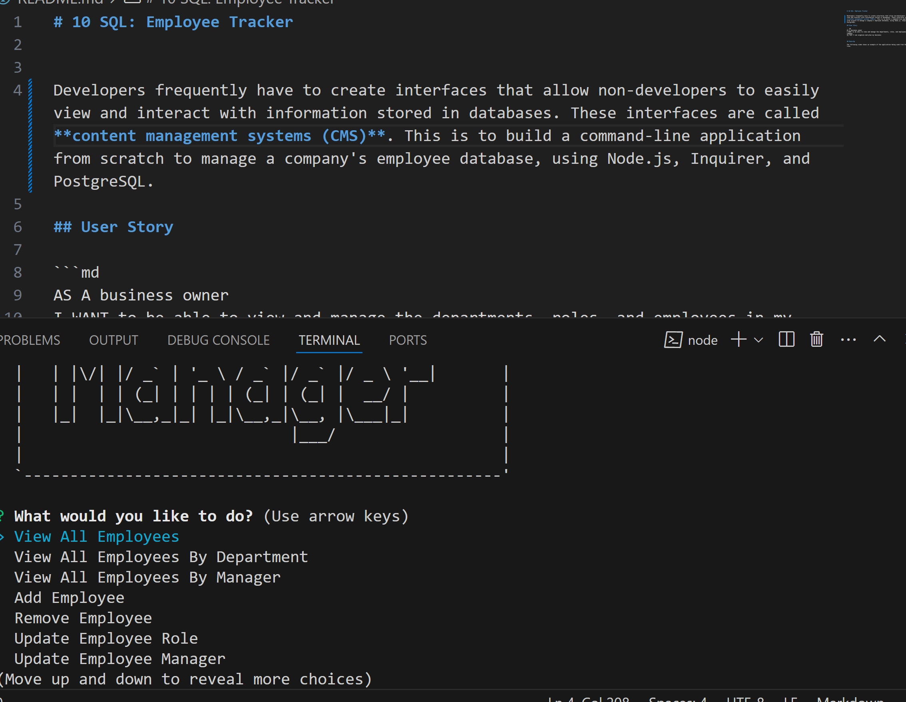

# 10 SQL: Employee Tracker

 
Developers frequently have to create interfaces that allow non-developers to easily view and interact with information stored in databases. These interfaces are called **content management systems (CMS)**. This is to build a command-line application from scratch to manage a company's employee database, using Node.js, Inquirer, and PostgreSQL.

## User Story

```md
AS A business owner
I WANT to be able to view and manage the departments, roles, and employees in my company
SO THAT I can organize and plan my business
```


## Mock-Up

The following video shows an example of the application being used from the command line:
[Employee.webm](https://github.com/user-attachments/assets/fab4626a-802e-4c32-8944-4b30035f7100)
